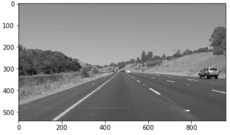
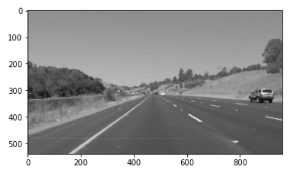
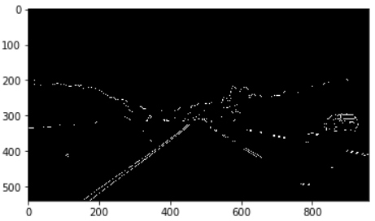
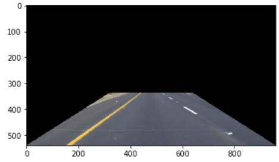
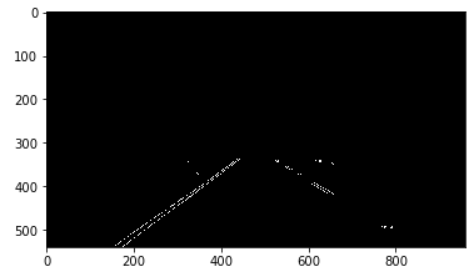
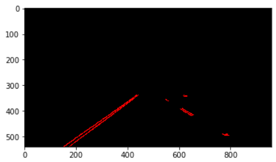

# CarND-Lane-Finding

## Pipeline for lane annotation of an image

### Convert img to grayscale and normalize image, s.t. images are not depending on light

### Gaussian blur on img

### Canny edge on img

### Define region-of-interest, which is large enough in order to contain lanes but small enough in order to ignore background

### Hough-transform img

### Calculate average lines left / right
		a. Calculate slopes and offset on detected linesslope > threshold (e.g. 0.3), since road is nearly straight aheady = mx + b = slope * x + offset
		b. Build two clusters from slopes (x-axis) and offsets (y-axis)Algorithm used: k-means
		c. Detect outliers with filtering within interquartile range
		d. Calculate new cluster centers without outliers
    e. Extrapolated lines = lines with parameters (offset, slope) of cluster centers
    
    f. Create new image with extrapolated lines
    

## Potential shortcomings
The implemented version of a line annotation detects straight lines but will probably not be able to detect lanes above certain curvatures. Furthermore, canny edge highlights edges within the image independent from its orientation. 

## Possible improvements
Instead of detecting straight lines it would be more realistic to fit a curve. Furthermore, a directed operator could be used for vertical edge detection. 
